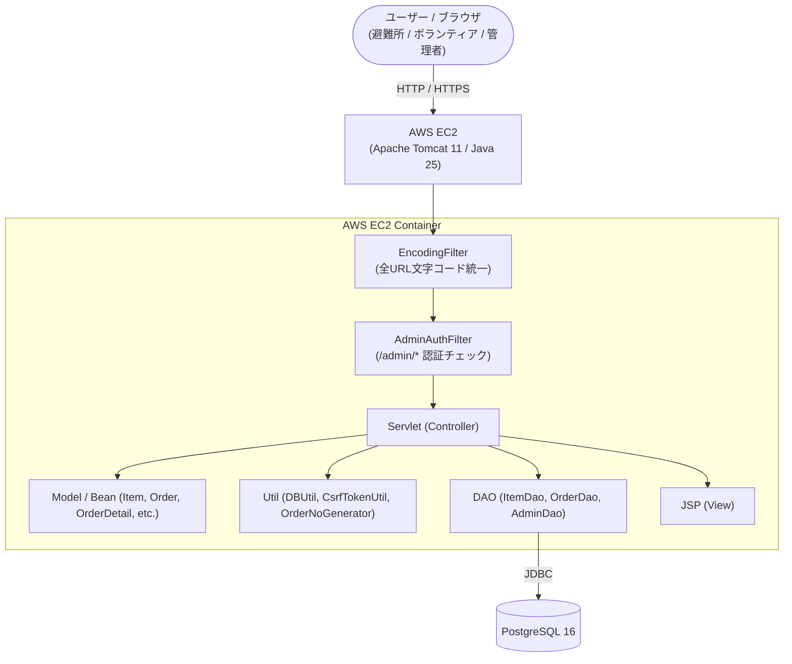

<a id="top"></a>
# アプリケーション「ラストワンマイル」

[](https://openjdk.org/)
[](https://tomcat.apache.org/)
[](https://www.postgresql.org/)
[](https://aws.amazon.com/ec2/)
[](https://www.eclipse.org/)
[](https://a5m2.mmatsubara.com/)

災害発生時における避難所からの物資要請と、ボランティアによる配送支援、管理者による物資在庫・配送状況の一元管理を支援するWebアプリケーションです。  
非常時でも迷わず直感的に要請・受付・配送ステータス管理ができるUIと、堅牢なデータ整合性・CSRF対策などのセキュリティを意識して開発しました。

> [!NOTE]  
> **本プロジェクトは、Java実習・Webアプリケーション開発実習時に作成したポートフォリオです。**  
> * **開発期間**: 26日 (要件定義、DB設計、画面設計、PG、結合テスト)  
> * **開発規模**: 2.5Kstep  
> * **開発支援（AI）**: Antigravity  
> * **アーキテクチャ**: MVCモデル（Servlet / JSP / DAO）

---

## 📑 目次
1. [画面イメージ](#section-images)
2. [主な機能](#section-features)
3. [使用技術・開発環境](#section-tech)
4. [システム構成](#section-architecture)
5. [ローカル環境での実行・セットアップ手順](#section-setup)
6. [工夫した点](#section-efforts)
7. [苦労した点・得られた教訓](#section-lessons)

---

<a id="section-images"></a>
## 💻 画面イメージ

*(※ 掲載画像はシステム画面の一部抜粋です)*

| 物資申請（被災者画面） | 配送一覧（管理者画面） |
| :---: | :---: |
|  |  |
| 必要な支援物資の選択・数量指定および避難所お届け先の簡単申請 | 全避難所からの要請状況・配送ステータスのリアルタイム確認と管理 |

---

<a id="section-features"></a>
## ✨ 主な機能

### 📦 避難所・被災者向け（物資要請）機能
* **支援物資の一覧・在庫確認**:
  * ジャンル（食料・日用品・衛生用品等）ごとの要請可能物資の閲覧およびリアルタイム在庫確認
* **カート管理＆要請申請（注文フロー）**:
  * 必要な物資・数量をカートに追加（`CartItem` 管理）
  * 避難所名・お届け先住所・受取人名・連絡先・備考（配慮事項等）の入力
  * 要請確認画面を経由し、CSRFトークン検証を挟んだ安全な要請確定処理
  * 注文完了時に一意な注文番号を自動発行（`OrderNoGenerator`）
* **要請状況の照会・キャンセル**:
  * 発行された注文番号による配送ステータス（未対応・対応中・完了・配送不可）の照会
  * 配送着手前の要請に対するキャンセル処理

### 🚚 ボランティア向け（配送支援）機能
* **配送案件一覧・詳細確認**:
  * 避難所から届いている物資要請案件の一覧取得
  * お届け先・必要物資・連絡先・配送メモ等の詳細確認
* **配送ステータスの更新**:
  * ボランティア担当者の受付登録、配送中、お届け完了へのステータス変更

### 🛡️ 管理者向け（物資・注文管理）機能
* **管理者認証・セッション管理**:
  * 管理者ログイン / ログアウト（Filterによる `/admin/*` 配下への未認証アクセス制御）
* **物資（アイテム）マスタ管理**:
  * 支援物資の新規登録・情報編集・削除
  * 保管場所（棚位置等）やジャンルIDの登録・管理
  * 各物資の在庫数増減・調整
* **要請（注文）管理**:
  * 全避難所からの要請一覧確認・ステータス検索
  * 要請明細の確認および管理者権限による注文取消・削除

---

<a id="section-tech"></a>
## 🧰 使用技術・開発環境

| カテゴリ | 技術スタック / バージョン |
| :--- | :--- |
| **開発期間** | 26日 |
| **開発規模** | 2.5Kstep |
| **開発支援（AI）** | Antigravity |
| **言語・ランタイム** | Java 25 (JavaSE-25 / OpenJDK) |
| **Webコンテナ / APサーバ** | Apache Tomcat 11 (Jakarta EE 10 / Servlet 6.1 / JSP 4.0) |
| **インフラ / ホスティング** | AWS (EC2) |
| **バックエンドアーキテクチャ** | MVCモデル (Java Servlet, JSP, JSTL 3.0, DAO, Model/Bean) |
| **データベース** | PostgreSQL 16 (JDBC接続) |
| **フロントエンド** | HTML5, CSS3, JavaScript |
| **セキュリティ・共通処理** | CSRFトークン認証、管理者認証フィルタ（`AdminAuthFilter`）、文字エンコーディングフィルタ（`EncodingFilter`） |
| **統合開発環境 (IDE)** | Eclipse (Eclipse IDE for Enterprise Java and Web Developers) |
| **DB管理・設計ツール** | A5:SQL Mk-2 |

---

<a id="section-architecture"></a>
## 📐 システム構成



---

<a id="section-setup"></a>
## 🛠️ ローカル環境での実行・セットアップ手順

### 1. 前提条件
* **Java**: JDK 25
* **Webコンテナ**: Apache Tomcat 11
* **データベース**: PostgreSQL 16
* **開発環境**: Eclipse (Eclipse IDE for Enterprise Java and Web Developers)

### 2. データベースの構築
1. PostgreSQLにてデータベース `last_onemile_db` を作成します。
2. 本システムに必要なテーブル（管理者マスタ `admin`、物資マスタ `items`、注文テーブル `orders`、注文詳細テーブル `order_details` 等）を作成します。

### 3. データベース接続設定 (`db.properties`)
接続設定ファイルは `src/main/java/` 配下（クラスパス直下）に配置します。  
`src/main/java/db.properties.sample` を参考に、ローカル環境の接続情報を設定してください。

```properties
db.url=jdbc:postgresql://localhost:5432/last_onemile_db
db.user=postgres
db.password=postgres
db.driver=org.postgresql.Driver
```

### 4. アプリケーションのデプロイ・起動
1. Eclipseに本プロジェクトをインポートします。
2. プロジェクトのターゲット・ランタイムに **Tomcat11 (Java25)** を設定します。
3. プロジェクトを右クリックし、`実行` -> `サーバーで実行` を選択します。
4. ブラウザから以下のURLにアクセスします。
   * 一般・被災者トップ画面: `http://localhost:8080/project/`（または `/project/top`）
   * 管理者ログイン画面: `http://localhost:8080/project/admin/login`

---

<a id="section-efforts"></a>
## 💡 <a id="工夫した点"></a>工夫した点

### 1. 災害現場を想定した直感的な導線設計
* 非常時の混乱した現場でも操作に迷わないよう意識しました。物資の選択から要請完了までのステップ（物資選択 → お届け先入力 → 内容確認 → 完了）を、できる限り無駄のないスムーズな画面フローで完結できるように組み立てました。

* 注文完了時には一意の注文番号を発行する仕組みを取り入れ、避難所側が後からでも自身の要請に対する配送ステータスの確認やキャンセルを迷わず行えるような追跡導線を意識して整備しました。

### 2. トランザクション制御と在庫整合性の担保
* 複数の物資を同時に申請する要請確定処理において、データが中途半端に登録されてしまうのを防ぐため実装に苦心しました。注文ヘッダ（orders）と注文明細（order_details）の登録、および物資マスタ（items）の在庫引き当て処理を一つのトランザクションにまとめ、エラーや異常が発生した際には確実にロールバックを行ってデータの不整合を防止する堅実な処理を実装しました。

### 3. セキュリティと堅牢性
* CSRF対策: 注文確定などの重要な更新処理において、CsrfTokenUtil を用いて一意のワンタイムトークンを発行・検証する仕組みを取り入れ、外部からの不正なリクエストを遮断できるようにしました。

* アクセス制御（Filter）: AdminAuthFilter を実装し、URLパターン /admin/* 配下へのアクセス時にセッションの管理者情報をチェックするよう制御しました。未ログイン状態での不正アクセスを自動で遮断し、ログイン画面へと安全に誘導します。

* SQLインジェクション対策: データベースへのアクセスを行うすべてのDAOにおいて、PreparedStatement によるプレースホルダを用いたクエリ実行を徹底し、セキュリティ面のリスク軽減に努めました。

---

<a id="section-lessons"></a>
## 🧗 <a id="苦労した点得られた教訓"></a>苦労した点・得られた教訓

### 1. 複数テーブルに跨るトランザクションとエラーハンドリング
* 注文登録と在庫数の連動処理において、途中で例外やエラーが発生した際のロールバック設計に最も苦労しました。コネクションの適切なオープン・クローズ管理や、setAutoCommit(false) を用いた手動でのトランザクション制御、例外発生時のロールバック処理を共通化することに注力しました。データ不整合を防ぎながら確実にデータを永続化する仕組みを構築する中で、実践的なバックエンドの設計手法を深く学ぶことができました。

### 2. フィルタとセッションの適切なライフサイクル管理
* 管理者権限ページへのアクセス制御（AdminAuthFilter）や、全リクエストに対する文字コード統一（EncodingFilter）の実装を通じ、セキュリティ担保と共通処理の重要性を実感しました。フィルターが実行される順序や、サーブレットコンテナ内でのライフサイクルの仕組みを一つひとつ検証しながら実装を進めたことで、Webアプリケーション全体の通信の流れに対する理解が大きく深まりました。

### 3. 画面・ロジックの責務分離（MVC）
* 開発初期はロジックと画面表示の境界が曖昧になっていましたが、保守性や可読性を高めるため、入力値の検証やデータ取得はServlet・DAO側に完全に集約し、JSP側はEL式やJSTLを用いた描画に専念させるMVCモデルの徹底に努めました。それぞれのコンポーネントが持つべき責務を明確に分離することの重要性と、保守しやすいコードベースを構築する設計の基本を学びました。