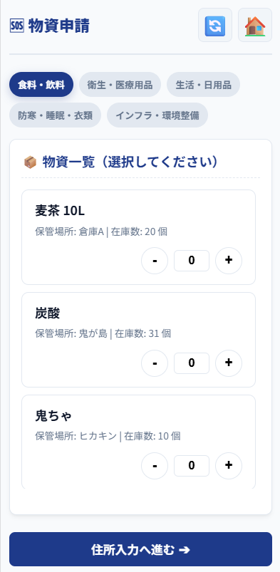
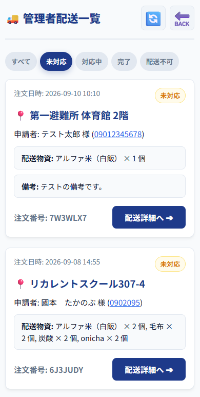
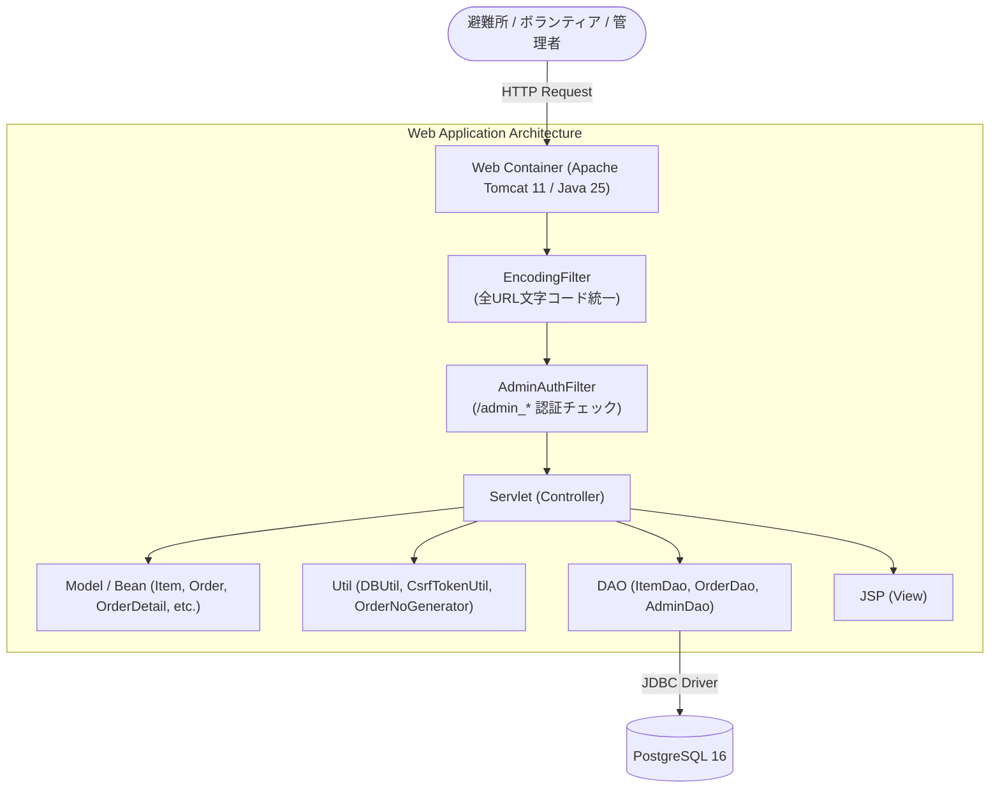

<a id="top"></a>
# アプリケーション「ラストワンマイル」（避難所 物資お届けSOS）

[](https://openjdk.org/)
[](https://tomcat.apache.org/)
[](https://www.postgresql.org/)
[](https://www.eclipse.org/)
[](https://a5m2.mmatsubara.com/)

災害発生時における避難所からの物資要請と、ボランティアによる配送支援、管理者による物資在庫・配送状況の一元管理を支援するWebアプリケーションです。  
非常時でも迷わず直感的に要請・受付・配送ステータス管理ができるUIと、堅牢なデータ整合性・CSRF対策などのセキュリティを意識して開発しました。

> [!NOTE]  
> **本プロジェクトは、Java実習・Webアプリケーション開発実習時に作成したポートフォリオです。**  
> * **開発期間**: 26日 (要件定義、DB設計、画面設計、PG、結合テスト)  
> * **開発規模**: 2.5Kstep  
> * **開発支援（AI）**: Antigravity  
> * **アーキテクチャ**: MVCモデル（Servlet / JSP / DAO）

---

## 📑 目次
1. [画面イメージ](#section-images)
2. [主な機能](#section-features)
3. [使用技術・開発環境](#section-tech)
4. [システム構成](#section-architecture)
5. [画面フロー・URLマッピング](#section-flow)
6. [ローカル環境での実行・セットアップ手順](#section-setup)
7. [工夫した点](#section-efforts)
8. [苦労した点・得られた教訓](#section-lessons)

---

<a id="section-images"></a>
## 💻 画面イメージ

*(※ 掲載画像はシステム画面の一部抜粋です)*

| 物資申請（被災者画面） | 配送一覧（管理者画面） |
| :---: | :---: |
|  |  |
| 必要な支援物資の選択・数量指定および避難所お届け先の簡単申請 | 全避難所からの要請状況・配送ステータスのリアルタイム確認と管理 |

---

<a id="section-features"></a>
## ✨ 主な機能

### 📦 避難所・被災者向け（物資要請）機能
* **支援物資の一覧・在庫確認**:
  * 要請可能な物資一覧の閲覧および在庫状況の確認
* **カート管理＆要請申請（注文フロー）**:
  * 必要な物資・数量をカートに追加（`CartItem` 管理）
  * 避難所名・お届け先住所・受取人名・連絡先・希望日時の入力
  * 要請確認画面を経由し、CSRFトークン検証を挟んだ安全な要請確定処理
  * 注文完了時に一意な注文番号を自動発行（`OrderNoGenerator`）
* **要請状況の照会・キャンセル**:
  * 発行された注文番号による配送ステータス（未着手・配送中・お届け完了など）の照会
  * 発送前の要請に対するキャンセル処理

### 🚚 ボランティア向け（配送支援）機能
* **配送案件一覧・詳細確認**:
  * 避難所から届いている物資要請案件の一覧取得
  * お届け先・必要物資・緊急度・配送メモ等の詳細確認
* **配送ステータスの更新**:
  * ボランティア担当者の受付登録、配送中、お届け完了へのステータス変更

### 🛡️ 管理者向け（物資・注文管理）機能
* **管理者認証・セッション管理**:
  * 管理者ログイン / ログアウト（Filterによる `admin_*` への未認証アクセス制御）
* **物資（アイテム）マスタ管理**:
  * 支援物資の新規登録（追加）・編集・削除
  * 各物資の在庫数増減・一括調整
* **要請（注文）管理**:
  * 全避難所からの要請一覧確認・ステータス検索
  * 要請明細の確認および管理者権限による注文取消・削除

---

<a id="section-tech"></a>
## 🧰 使用技術・開発環境

| カテゴリ | 技術スタック / バージョン |
| :--- | :--- |
| **開発期間** | 26日 |
| **開発規模** | 2.5Kstep |
| **開発支援（AI）** | Antigravity |
| **言語・ランタイム** | Java 25 (OpenJDK) |
| **Webコンテナ / APサーバ** | Apache Tomcat 11 (Jakarta EE 10 / Servlet 6.1 / JSP 4.0) |
| **バックエンドアーキテクチャ** | MVCモデル (Java Servlet, JSP, JSTL 3.0, DAO, DTO/Model) |
| **データベース** | PostgreSQL 16 (JDBC接続) |
| **フロントエンド** | HTML5, CSS3, JavaScript |
| **セキュリティ・共通処理** | CSRFトークン認証、管理者認証フィルタ（`AdminAuthFilter`）、文字エンコーディングフィルタ（`EncodingFilter`） |
| **統合開発環境 (IDE)** | Eclipse (Eclipse IDE for Enterprise Java and Web Developers) |
| **DB管理・設計ツール** | A5:SQL Mk-2 |

---

<a id="section-architecture"></a>
## 📐 システム構成



---

<a id="section-flow"></a>
## 📖 画面フロー・URLマッピング

```text
【避難所・一般フロー】
/top (トップ画面 / index.jspからリダイレクト)
 ├─ /order_items (物資一覧・カート追加)
 │   └─ /order_address (お届け先・避難所情報入力)
 │       └─ /order_confirm (要請内容確認 / CSRFトークン発行・検証)
 │           └─ /order_complete (要請完了・注文番号表示)
 └─ /order_status (要請状況の確認・検索)
     └─ /order_cancel (要請キャンセル処理)

【ボランティアフロー】
/top
 └─ /volunteer_list (配送支援案件一覧)
     ├─ /volunteer_detail (案件詳細確認)
     └─ /volunteer_status (配送ステータス更新)

【管理者フロー】
/admin_login (管理者ログイン画面)
 └─ [AdminAuthFilter によるセッション認証検証]
     └─ /admin_menu (管理者メニュー)
         ├─ /admin_items (物資マスタ一覧)
         │   ├─ /admin_item_add (物資新規登録)
         │   ├─ /admin_item_edit (物資情報編集)
         │   ├─ /admin_item_stock (在庫数調整)
         │   └─ /admin_item_delete (物資削除)
         └─ /admin_orders (注文一覧・管理)
             ├─ /admin_order_detail (注文詳細確認)
             └─ /admin_order_delete (注文削除・取消)
```

---

<a id="section-setup"></a>
## 🛠️ ローカル環境での実行・セットアップ手順

### 1. 前提条件
* **Java**: JDK 25
* **Webコンテナ**: Apache Tomcat 11
* **データベース**: PostgreSQL 16
* **開発環境**: Eclipse (Eclipse IDE for Enterprise Java and Web Developers)

### 2. データベースの構築
1. PostgreSQLにてデータベースを作成します（デフォルトでは `postgres` データベースを使用）。
2. 本システムに必要なテーブル（管理者マスタ `admins`、物資マスタ `items`、注文テーブル `orders`、注文詳細テーブル `order_details` 等）を作成します。

### 3. データベース接続設定 (`db.properties`)
接続設定ファイルは `/src/main/resources/` または `/src/main/java/` 配下に配置します。  
同梱の `db.properties.sample` を基に `db.properties` を作成し、ローカル環境に合わせて接続情報を設定してください。

```properties
db.url=jdbc:postgresql://localhost:5432/postgres
db.user=postgres
db.password=postgres
db.driver=org.postgresql.Driver
```

### 4. アプリケーションのデプロイ・起動
1. Eclipseに本プロジェクトをインポートします。
2. プロジェクトのターゲット・ランタイムに **Apache Tomcat 11** を設定します。
3. プロジェクトを右クリックし、`実行` -> `サーバーで実行` を選択します。
4. ブラウザから以下のURLにアクセスします。
   * 一般・被災者トップ画面: `http://localhost:8080/project/`（または `/project/top`）
   * 管理者ログイン画面: `http://localhost:8080/project/admin_login`

---

<a id="section-efforts"></a>
## 💡 工夫した点

### 1. 災害現場を想定した直感的な導線設計
* 非常時の混乱した現場でも操作に迷わないよう、物資の選択から要請完了までのステップ（一覧 -> カート -> 住所入力 -> 確認 -> 完了）を最短の手順で完結できる画面フローに設計しました。
* 注文番号の発行により、後からステータス確認やキャンセルをスムーズに行える仕組みを導入しました。

### 2. トランザクション制御と在庫整合性の担保
* 複数の物資を同時に申請する要請確定処理において、注文ヘッダ（`orders`）と注文明細（`order_details`）の登録、および物資マスタ（`items`）の在庫引き当てを単一トランザクション内で実行。異常発生時には確実にロールバックを行い、在庫数や注文情報の不整合を防止しました。

### 3. セキュリティと堅牢性
* **CSRF対策**: 注文確定などの更新処理において、`CsrfTokenUtil` を用いて一意のワンタイムトークンを発行・検証し、外部からの不正リクエストを遮断。
* **アクセス制御（Filter）**: `AdminAuthFilter` により、URLパターン `/admin_*` へのアクセスに対してセッション内の管理者認証情報をチェック。未ログイン状態での不正アクセスを自動遮断し、ログイン画面へリダイレクト。
* **SQLインジェクション対策**: すべてのDAOで `PreparedStatement` によるプレースホルダ処理を徹底。

---

<a id="section-lessons"></a>
## 🧗 苦労した点・得られた教訓

### 1. 複数テーブルに跨るトランザクションとエラーハンドリング
注文登録と在庫数の連動処理において、途中で在庫不足や例外が発生した際のロールバック設計に注力しました。コネクションの適切なオープン/クローズ、自動コミットの無効化（`setAutoCommit(false)`）、例外発生時のロールバック処理を共通化することで、安定したデータ永続化の設計手法を身につけました。

### 2. フィルタとセッションの適切なライフサイクル管理
管理者権限ページへのアクセス制御（`AdminAuthFilter`）や、全リクエストに対する文字コード設定（`EncodingFilter`）の実装を通じ、サーブレットコンテナのライフサイクルとフィルタチェインの動作順序への理解を深めました。

### 3. 画面・ロジックの責務分離（MVC）
JSPに複雑なビジネスロジックを持ち込まず、入力値バリデーションやデータ取得はServlet/DAO側で完結させ、JSP側はEL式やJSTLを用いた描画に専念させることで、保守性の高いコードベースを構築する重要性を学びました。